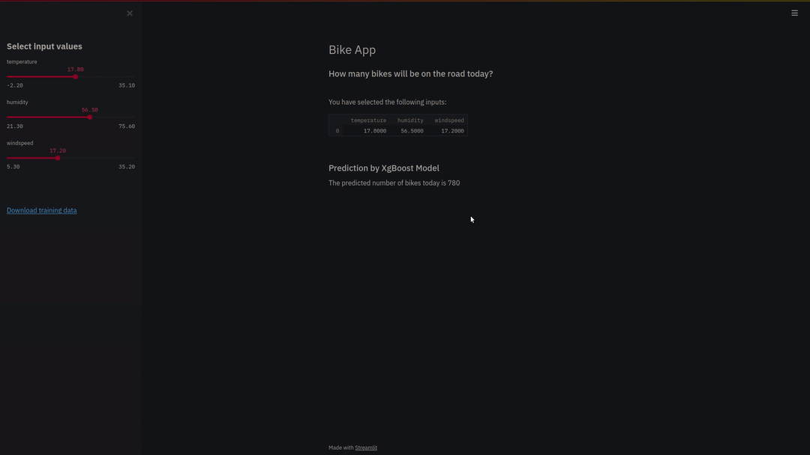

# Streamlit Bike-App deployed on Heroku

## Directory

```
bikeapp-streamlit
├── model                                         
│     └── xgbmodel.h5                         <- trained xgboost model  
├── Demo                                         
│     └── Demo.gif 
├── streamlit_app.py                          <- streamlit                                
├── Procfile                                  <- commands to be executed by heroku on app startup 
├── requirements.txt                          <- heroku app dependencies  
├── setup.sh                                  <- setup for heroku  
├── runtime.txt                               <- specify python version for heroku
├── train.py                                  <- train model
└── README.md
```


Bike App makes prediction about the number of bikes on the road based on temperature, humidity, and windspeed.

## Demo



Bike App is deployed on Heroku live at [HERE](https://bikeapp-streamlit.herokuapp.com/)

## Libraries

- streamlit
- pandas
- xgboost
- pickle
- sklearn


## Installation


```bash
# Create the virtual environent using conda
$ conda env create -f environment.yml
$ conda activate bikeapp-streamlit

# Run the python scripts
$ python train.py  # train xgboost model
$ streamlit run streamlit_app.py  # serve streamlit app
